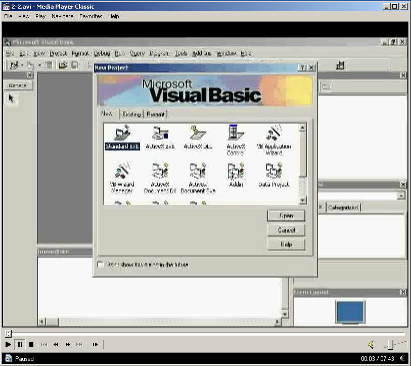



## Training Video Visual basic Database Tutorial

### Description

Full Movie Tutorial:

This is part one in a serious of video tutorials that explain visual basic Database programming, This tutorial shows you how to create a database browser without one line of source code
 
### More Info
 

             |
---                |---
**Submitted On**   |2005-12-23 08:12:20
**By**             |[OpcodeVoid](https://github.com/Planet-Source-Code/PSCIndex/blob/master/ByAuthor/opcodevoid.md)
**Level**          |Beginner
**User Rating**    |5.0 (25 globes from 5 users)
**Compatibility**  |VB 5\.0, VB 6\.0
**Category**       |[Databases/ Data Access/ DAO/ ADO](https://github.com/Planet-Source-Code/PSCIndex/blob/master/ByCategory/databases-data-access-dao-ado__1-6.md)
**World**          |[Visual Basic](https://github.com/Planet-Source-Code/PSCIndex/blob/master/ByWorld/visual-basic.md)
**Archive File**   |[Training\_V19595212242005\.zip](https://github.com/Planet-Source-Code/opcodevoid-training-video-visual-basic-database-tutorial__1-63782/archive/master.zip)

### Source Code

The movie is part one of this serious.

